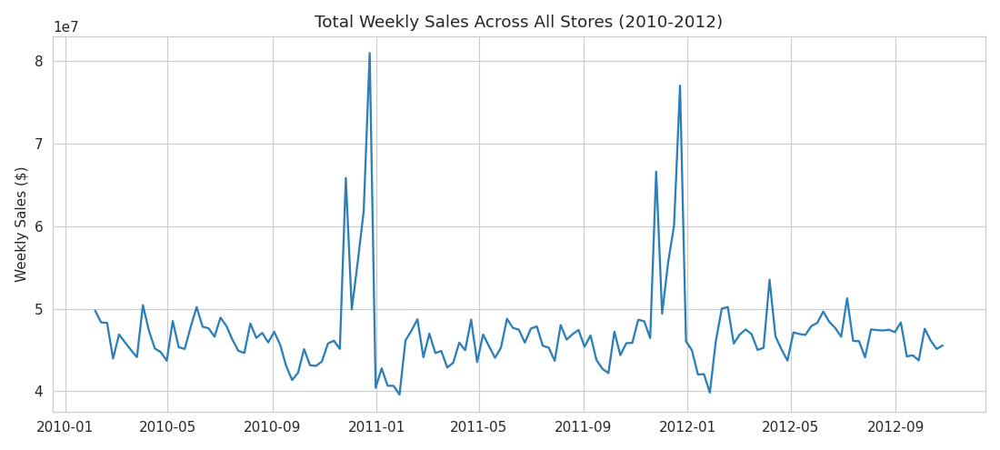
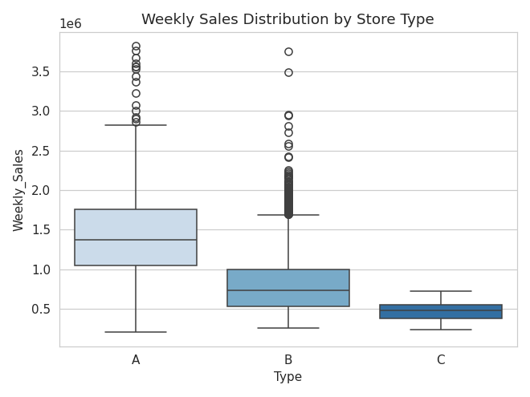
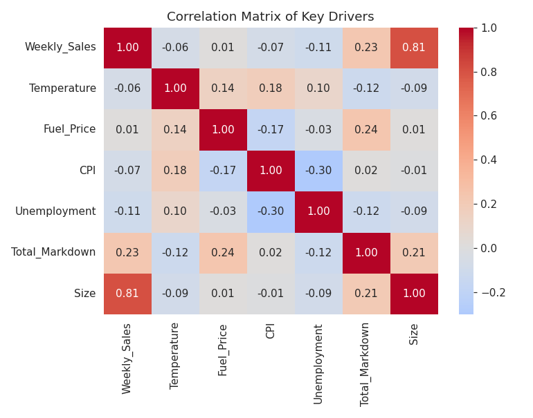
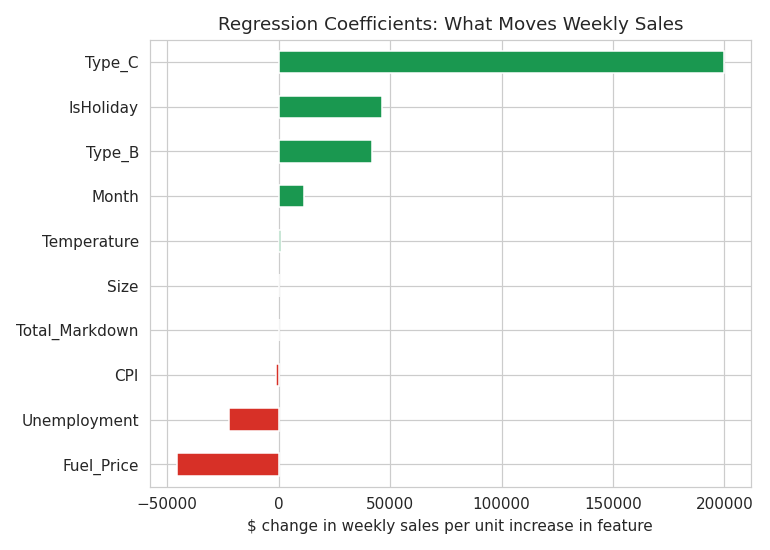
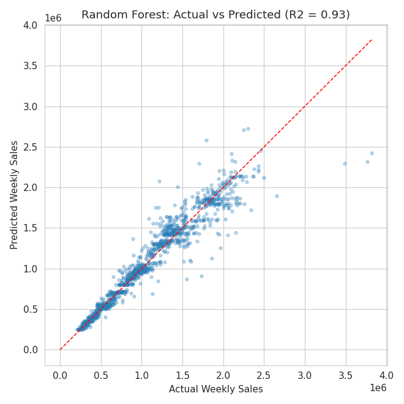
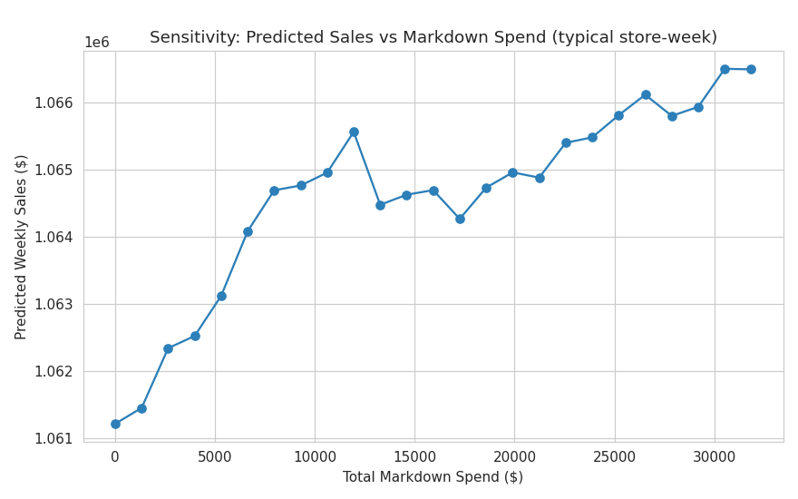
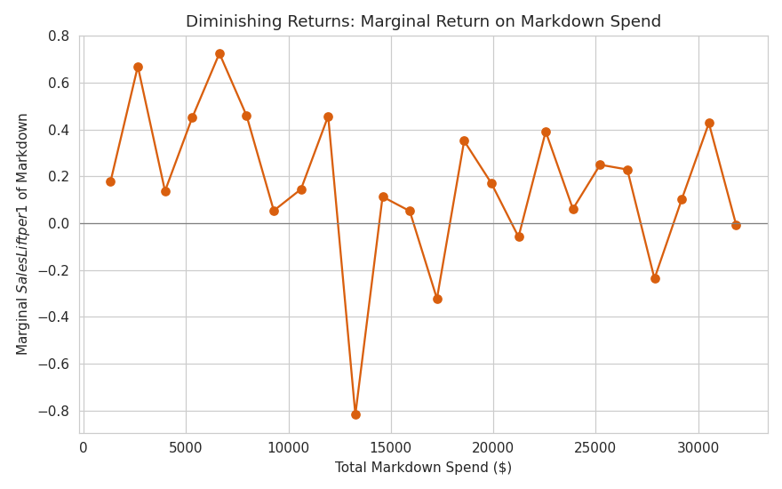

# Sales Regression & Markdown Sensitivity Analysis - Does Discounting Actually Pay Off?

Every retailer runs markdowns. Almost none of them stop to ask if the extra sales those markdowns generate are actually worth what they cost. That's the question I set out to answer with this project.

Using 45 Walmart stores' weekly sales data, I built a regression model to figure out what really drives weekly sales, then used that model to run a "what-if" sensitivity test specifically on promotional markdown spend, to see whether discounting is paying for itself.

---

## Business Questions Addressed

1. **What drives weekly sales?** How much do store size, store type, holidays, and economic conditions matter, relative to markdowns?
2. **Is markdown spend revenue-additive?** If we spend more on promotional discounts, does predicted sales increase enough to justify it?
3. **Where's the point of diminishing returns?** At what markdown level does each extra dollar spent stop generating at least a dollar back in sales?

---

## Tools & Technologies

- **Python (Pandas)** - data merging, cleaning, feature engineering
- **Scikit-learn** - Linear Regression (for interpretability) and Random Forest (as a stronger predictive benchmark)
- **Matplotlib / Seaborn** - EDA and sensitivity visualizations
- **Sensitivity / What-If Analysis** - holding real store-week feature combinations constant, varying only markdown spend, and averaging predictions to isolate its effect

---

## Data

Raw files (`train.csv`, `features.csv`, `stores.csv`) come from the [Walmart Recruiting – Store Sales Forecasting](https://www.kaggle.com/c/walmart-recruiting-store-sales-forecasting/data) Kaggle competition. 

---

## Methodology

1. Aggregated `train.csv` (department-level) up to store-week totals, then merged in `features.csv` (markdowns, CPI, fuel price, unemployment, temperature) and `stores.csv` (type, size).
2. Filled missing markdown values with 0 (meaning: no promotion that week) and summed the five markdown categories into a single `Total_Markdown` feature.
3. Trained a **Linear Regression** model for clean, interpretable coefficients, and a **Random Forest** as a stronger predictive benchmark.
4. For the sensitivity test, took a random sample of 2,000 real store-weeks, overrode only `Total_Markdown` across a range of scenario values (holding every other real feature combination fixed), and averaged the Random Forest's predictions at each level. This isolates the markdown effect while avoiding the noisy, step-shaped curve you'd get from a single synthetic "average store" fed into a tree model.

---

## Key Results

| Model | R² | MAE |
|---|---|---|
| Linear Regression | 0.674 | $242,759 |
| Random Forest | **0.930** | **$86,524** |

### What actually drives sales

- **Store size** is the single strongest driver: A 0.81 correlation with weekly sales that dwarfs everything else.
- **Store type** matters a lot too: Type C and Type B stores show noticeably different baseline sales than Type A even after controlling for size. Worth flagging as a caveat, though store type and size are correlated with each other in this dataset (multicollinearity), so read these coefficients directionally rather than as precise dollar effects.
- **Holiday weeks**: They run about **8% higher** in average sales ($1.12M vs. $1.04M per store-week).
- **Fuel price and unemployment**: Both show small negative relationships with sales.
- **Total markdown spend**: This has the weakest relationship of all the numeric features tested. Just a 0.23 correlation with sales, which sets up the real finding below.

### The markdown sensitivity finding

Across the full range of markdown spend tested (roughly $0 to $32K per store-week), the **marginal sales lift per extra $1 of markdown never crossed $1**, it averaged about **$0.17 of extra sales for every $1 spent**.

In plain English: in this dataset, **markdown spend doesn't pay for itself through incremental sales alone.** It's probably doing other jobs, clearing aging inventory, matching a competitor's price, protecting market share rather than acting as a pure revenue driver.

That's a useful, if slightly uncomfortable, insight for a retailer. It reframes the conversation from "markdowns increase sales" to "markdowns need to be justified on grounds other than sales lift."

---

## Visuals



*Total sales trend across all stores, 2010–2012*



*Sales distribution by store type*



*Correlation of all key numeric drivers*



*Which features push sales up or down, and by how much*



*Random Forest model fit*



*Predicted sales as markdown spend increases*



*Marginal $ return per $1 of markdown spend*

---

## Repository Structure

```
project3_walmart/
│
├── analysis.py                       # Full pipeline: merge → EDA → model → sensitivity
├── merged_store_weekly.csv           # Cleaned, merged modeling dataset
├── markdown_sensitivity_table.csv    # Scenario-by-scenario sensitivity output
├── charts/
│   ├── 01_sales_trend.png
│   ├── 02_sales_by_store_type.png
│   ├── 03_correlation_heatmap.png
│   ├── 04_regression_coefficients.png
│   ├── 05_actual_vs_predicted.png
│   ├── 06_markdown_sensitivity_curve.png
│   └── 07_marginal_return_curve.png
└── README.md
```

---

## Conclusion

This project is an end-to-end regression and sensitivity analysis: merging multi-table retail data, building both an interpretable model and a high-accuracy predictive one, and then actually using that model to answer a business "what-if" question instead of stopping at prediction accuracy. The headline finding that discount spend isn't reliably revenue-additive in this dataset is the kind of result that reframes a business decision, not just describes historical data.

## Future Scope

- **Category/department-level sensitivity** - markdown effectiveness likely varies a lot by department (electronics vs. groceries, for instance); this analysis is store-level only.
- **Interaction effects** - test whether markdowns work better specifically during holiday weeks vs. regular weeks.
- **Price elasticity** - extend this into a formal elasticity model (% change in sales per % change in effective price) instead of raw markdown dollars.
- **Power BI What-If Parameter** - rebuild the sensitivity slider as an interactive Power BI parameter for a live, clickable version of this analysis.

## Author

**Rinit Jain**
