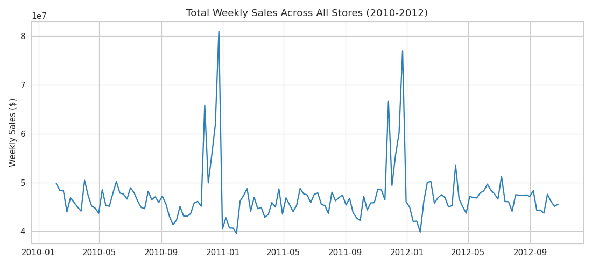
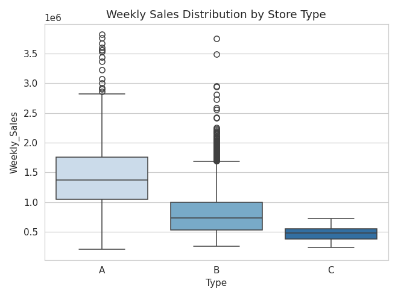
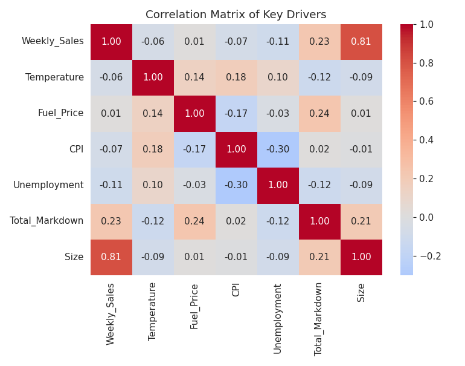
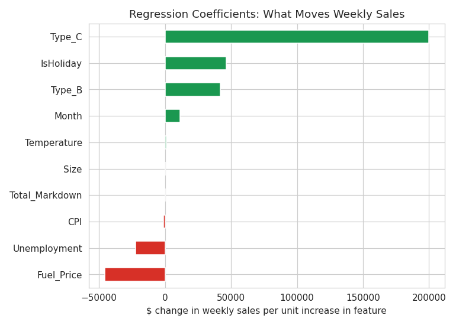
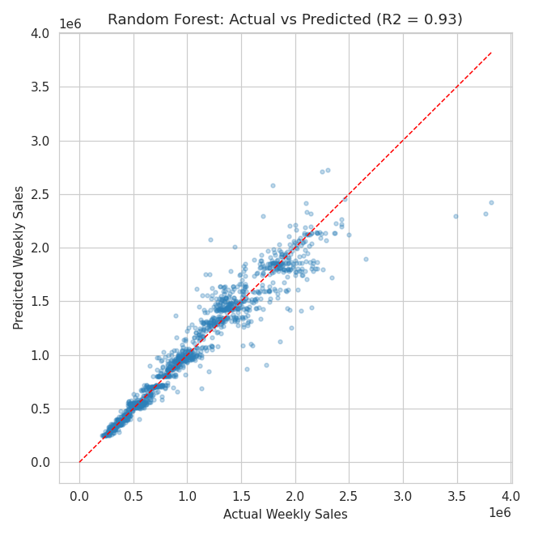
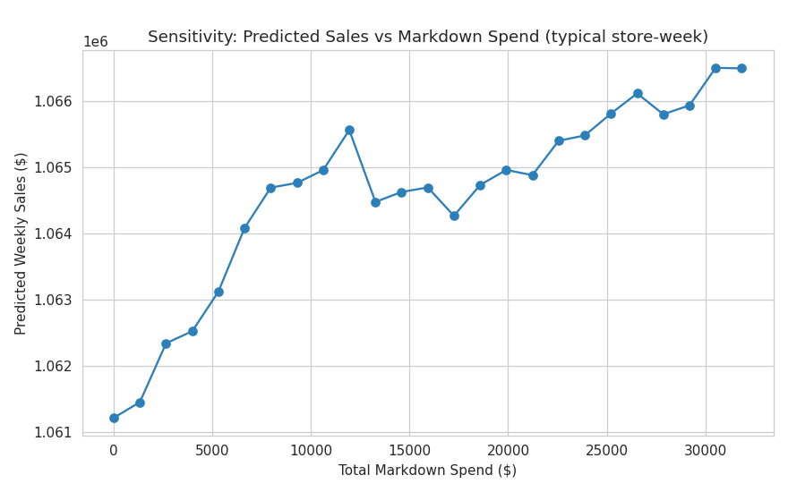
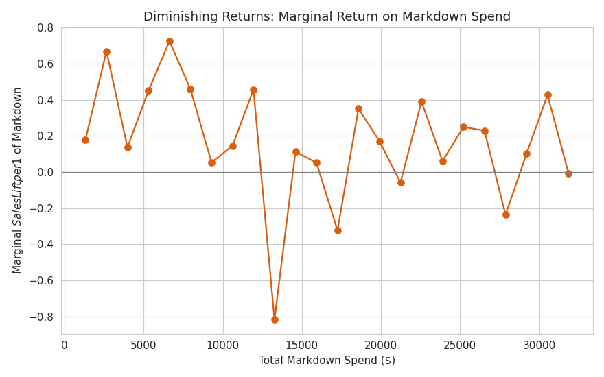

# Sales Regression & Discount Sensitivity Analysis: Does Discounting Pay Off

## The Question Every Retailer Avoids

Every retailer runs discounts. Almost none of them stop to ask whether the extra sales those discounts generate are actually worth what they cost. That is the question I set out to answer with this project.

Using 45 Walmart stores' weekly sales data, I built a regression model to figure out what really drives weekly sales, then used that model to run a what if sensitivity test specifically on promotional discount spend, to see whether discounting is actually paying for itself.

## Business Questions Answered

* **Sales Drivers:** How much do store size, store type, holidays, and economic conditions matter, relative to discounts, in driving weekly sales.
* **Revenue Additive Spend:** If the business spends more on promotional discounts, does predicted sales increase enough to justify it.
* **Diminishing Returns:** At what discount level does each extra dollar spent stop generating at least a dollar back in sales.

## Project Scope

The analysis covers two years of weekly sales data across 45 Walmart stores, combining store attributes, macroeconomic indicators, and promotional discount spend into a single store week dataset. The scope is deliberately store level rather than department level, meaning the findings describe how an entire store responds to discounting, not how any one product category does. The end goal is a working regression model that can be queried with hypothetical discount levels to see the predicted effect on sales.

## Tools & Methodologies

* **Python (Pandas):** data merging, cleaning, feature engineering.
* **Scikit learn:** Linear Regression for interpretability, and Random Forest as a stronger predictive benchmark.
* **Matplotlib / Seaborn:** EDA and sensitivity visualizations.
* **Sensitivity / What If Analysis:** holding real store week feature combinations constant, varying only discount spend, and averaging predictions to isolate its effect.

## Model Performance & Key Visuals

| Model | R² | MAE |
| :--- | :---: | :---: |
| Linear Regression | 0.674 | $242,759 |
| Random Forest | **0.930** | **$86,524** |



*Total sales trend across all stores, 2010 to 2012*



*Sales distribution by store type*



*Correlation of all key numeric drivers*



*Which features push sales up or down, and by how much*



*Random Forest model fit*



*Predicted sales as discount spend increases*



*Marginal dollar return per $1 of discount spend*

* **Store size is the single strongest driver**: a 0.81 correlation with weekly sales that dwarfs everything else.
* **Store type matters too**: Type C and Type B stores show noticeably different baseline sales than Type A even after controlling for size, though store type and size are correlated with each other here, so these coefficients read directionally rather than as precise dollar effects.
* **Holiday weeks run about 8% higher**: $1.12M versus $1.04M in average sales per store week.
* **Fuel price and unemployment**: both show small negative relationships with sales.
* **Total discount spend is the weakest numeric driver tested**: just a 0.23 correlation with sales, which sets up the real finding below.
* **The sensitivity test result**: across the full range of discount spend tested, roughly $0 to $32K per store week, the marginal sales lift per extra dollar of discount never crossed a dollar, averaging about **$0.17 of extra sales for every $1 spent**.
* **The reframe**: discount spend does not pay for itself through incremental sales alone in this dataset. It is probably doing other jobs, clearing aging inventory, matching a competitor's price, protecting market share, rather than acting as a pure revenue driver.

## Skills Demonstrated

Regression modeling, predictive benchmarking with ensemble methods, feature engineering across multi table data, sensitivity and scenario analysis, and translating a model's output into a plain business recommendation rather than stopping at prediction accuracy.

## Repository Structure

```
project3_walmart/
│
├── analysis.py                       # Full pipeline: merge, EDA, model, sensitivity
├── merged_store_weekly.csv           # Cleaned, merged modeling dataset
├── markdown_sensitivity_table.csv    # Scenario by scenario sensitivity output
├── charts/
│   ├── 01_sales_trend.png
│   ├── 02_sales_by_store_type.png
│   ├── 03_correlation_heatmap.png
│   ├── 04_regression_coefficients.png
│   ├── 05_actual_vs_predicted.png
│   ├── 06_markdown_sensitivity_curve.png
│   └── 07_marginal_return_curve.png
└── README.md
```

## Key Takeaway

This is an end to end regression and sensitivity analysis: merging multi table retail data, building both an interpretable model and a high accuracy predictive one, then actually using that model to answer a business what if question instead of stopping at prediction accuracy. The headline finding, that discount spend is not reliably revenue additive in this dataset, is the kind of result that reframes a business decision rather than just describing historical data.

## Future Scope

* Test category or department level sensitivity, since discount effectiveness likely varies a lot by department, electronics versus groceries for instance, and this analysis is store level only.
* Test interaction effects, whether discounts work better specifically during holiday weeks versus regular weeks.
* Extend this into a formal price elasticity model, percent change in sales per percent change in effective price, instead of raw discount dollars.
* Rebuild the sensitivity slider as an interactive Power BI what if parameter for a live, clickable version of this analysis.

## Author

**Rinit Jain**
